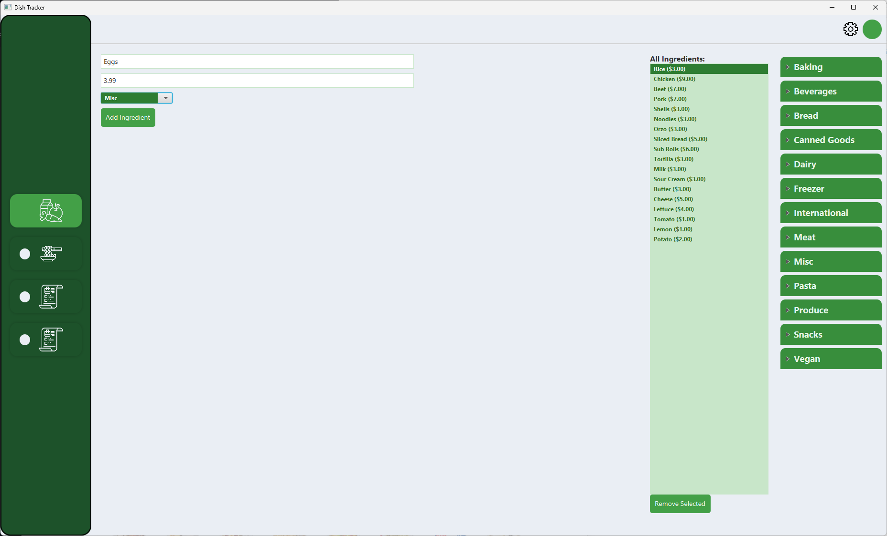
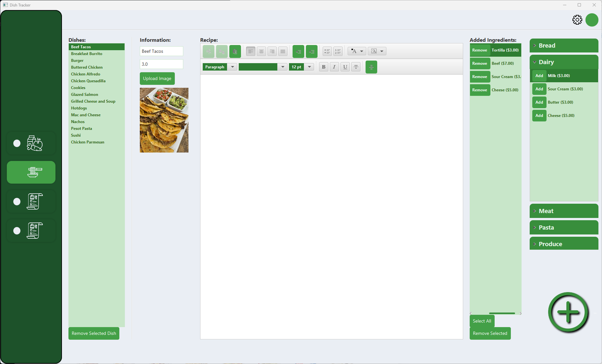
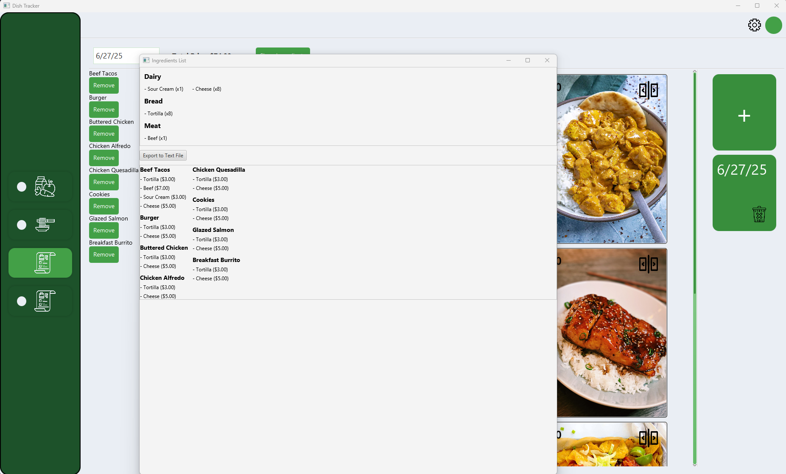

# Overview
This application was made to help budgeting and make grocery lists easier to make for myself. The application tells the total price of the grocery list and organizes the list by catagory so it's quicker to shop in the store. It uses JavaFX for the GUI. Fxml for the layout. 

## How to use
### Add ingredients

Here you can put a name, price, and the catagory of the ingredients. The application will automatically place the ingredients in the all section and also in the accordian organizers. To remove an ingredient you can click on it in the all section and hit remove. You can click multiple at one time to remove.

### Add dishes

Once you have some ingredients added you can make dishes. You start off filling in basic information like the name and how many servings it will produce when made. You can also upload an image for the dish but not neccessay. You can also write the recipe for the dish but, again, not neccessary. Now you need to add the ingredients to the dish. The ingredients will be the ones you added previously and will be found on the right. You find the ingredient you want to add and then hit add. Once added, in the add ingredients section you can increase/decrease the amount and also remove ingredients from the dish. Once done, to finilize everything hit the bottom right button.

### Make grocery list

To start making a grocery list you hit the plus card on the right. You can then name it using the text box top left. This text box also lets you know what grocery list you have selected. To add dishes to the list you just click on the dish cards. The dish cards show the name, total price, and ingredients. The cards can also be flipped over to show the recipe. On the left is where you can remove dishes. The total price of the list will be displayed at the top.

### Show ingredients list

This is an example of what the user will see when they click on the show ingredients button when they have a grocery list selected. The list is organized at the top by catagory making it easier to shop for things in the store. A button is also providing to export it to a .txt file. This is helpful for sending the list to a phone. Below the button is each dish with the ingredients. In the picture, the ingredients are kind of random because it's just an example.

### Import/Export
The last tab of the application is used to import/export save data in the .ser format. This file can then be used as a back up or sent to a friend to import your made dishes.

## Future 
- Improve the UI and Layout
- Use an API to fetch ingredient information automatically.
- Make themes
- Make the user sign into an account and have the data saved to a database.
- Make a mobile version (Working on this now)
